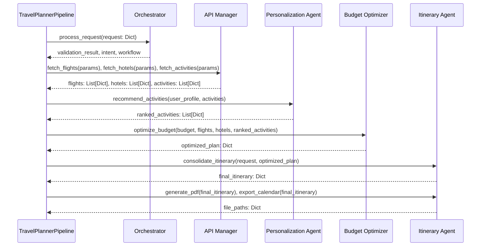

# Advanced Technical Deep Dive: TravelAI Backend

## 1. Executive Summary

This document provides an advanced technical overview of the TravelAI backend, a sophisticated Multi-Agent System (MAS) designed to automate the generation of hyper-personalized travel itineraries. The system leverages a microservices-style architecture where each agent is a specialized, decoupled component. It integrates real-time data from external APIs, employs a Graph Neural Network (GNN) for personalization, and uses a constrained optimization model for budget management. The final output is a complete, actionable travel plan delivered in multiple user-friendly formats.

---

## 2. System Architecture & Data Flow

The backend is architected as a sequential pipeline of agents, orchestrated by a central controller. This design ensures a clear separation of concerns and facilitates modularity and scalability.

### 2.1. High-Level Architectural Flowchart

This diagram illustrates the end-to-end process, from receiving a user request to returning a fully-formed itinerary.

```mermaid
graph TD
    A[User Interacts with UI <br/>(app.py)] --> B{Sidebar Form};
    B -- Fill & Submit --> C{Build Request Object};
    C -- Dict --> D[process_travel_request() function];
    D -- Instantiate & Call --> E{Backend: TravelPlannerPipeline};
    E -- Progress Callback --> F[update_progress() function];
    F -- Update UI --> G[Progress Bar & Status Text];
    E -- Return Result --> H{Store in Session State <br/>(st.session_state.result)};
    H -- Data --> I{Render Results View};
    
    subgraph "UI Components (components/)"
        I --> J[itinerary_display.py];
        I --> K[pdf_download.py];
        I --> L[feedback_form.py];
    end

    style B fill:#e3f2fd,stroke:#333,stroke-width:2px
    style D fill:#e3f2fd,stroke:#333,stroke-width:2px
    style E fill:#c8e6c9,stroke:#333,stroke-width:2px
    style H fill:#fff9c4,stroke:#333,stroke-width:2px
```
---

### 2.2. Agent Communication & Data Contracts

Agents communicate by passing structured data objects. The output of one agent serves as the input for the next, creating a well-defined data flow.



-   **Contract 1 (Orchestrator -> API Manager):** A set of structured parameters for each data type (e.g., `origin`, `destination`, `start_date` for flights).
-   **Contract 2 (API Manager -> Personalization Agent):** Lists of standardized data objects (dictionaries) for flights, hotels, and activities, parsed from various API responses.
-   **Contract 3 (Personalization Agent -> Budget Optimizer):** The same lists, but now enriched with a `personalization_score` for each item and sorted by relevance.
-   **Contract 4 (Budget Optimizer -> Itinerary Agent):** A single, structured dictionary (`optimized_budget`) containing the final selected flight, hotel, and list of activities that meet the budget constraints.
-   **Contract 5 (Itinerary Agent -> Final Output):** The master `itinerary` object, containing the daily schedule, budget summary, and paths to the generated PDF and ICS files.

---

## 3. Deep Dive: Agent Components

### 3.1. Orchestrator Agent (`orchestrator.py`)

The `LlamaOrchestrator` is the pipeline's entry point and controller.

-   **Core Logic:**
    -   **Validation (`validate_request`):** It uses the `ConstraintValidator` utility to perform a series of checks defined in `config.yaml`. This includes:
        -   `validate_dates`: Ensures the trip is not in the past, the duration is within the configured min/max (1-30 days), and it meets the advance booking requirement.
        -   `validate_budget`: Checks if the budget is within the configured min/max ($100 - $100,000).
        -   `validate_group_size`: Ensures the group size is between 1 and 20.
    -   **Intent Parsing (`parse_user_intent`):** It employs rule-based keyword matching on the user's query and preferences to classify the `trip_type` (e.g., "adventure", "leisure") and `primary_goal` (e.g., "explore", "relax"). This structured intent is used to guide downstream agents.

### 3.2. API Manager (`api_manager.py`)

This agent is a highly asynchronous data-fetching module that interfaces with all external services.

-   **Core Logic:**
    -   It uses `aiohttp` to make non-blocking, parallel API calls, significantly speeding up the data collection phase.
    -   It implements a **provider abstraction layer**. The configuration in `config.yaml` determines which service to call for each data type (e.g., `provider: "serpapi"` for flights).
    -   A **mock fallback** system is built-in. If a real API call fails or returns no data, the manager generates realistic mock data to ensure the user experience is not interrupted.

-   **Detailed API Call Analysis:**
    -   **Flights (SERP API - Google Flights):**
        -   **Strategy:** It first attempts a direct round-trip query. If that fails, it falls back to making two separate one-way API calls (one for outbound, one for return) and then programmatically combines the results into round-trip options.
        -   **Endpoint:** `https://serpapi.com/search.json`
        -   **Key Parameters:** `engine: 'google_flights'`, `departure_id`, `arrival_id`, `outbound_date`, `return_date`, `travel_class`.
        -   **Parsing Logic:** The `_parse_oneway_flight` function is crucial. It handles multi-segment flights by identifying layovers and calculating total duration across all legs of a one-way journey.
    -   **Hotels (SERP API - Google Hotels):**
        -   **Endpoint:** `https://serpapi.com/search.json`
        -   **Key Parameters:** `engine: 'google_hotels'`, `q: destination`, `check_in_date`, `check_out_date`, `adults`.
        -   **Parsing Logic:** The `_parse_serpapi_hotels` function extracts and standardizes key information, including name, rating, price, amenities, and images. It calculates the total price based on the per-night rate and trip duration.
    -   **Activities (OpenStreetMap - 100% Free):**
        -   **Strategy:** This is a multi-step, key-less process.
            1.  **Geocode:** It first hits the `nominatim.openstreetmap.org/search` endpoint to get the latitude and longitude of the destination.
            2.  **Query POIs:** It then constructs an Overpass QL query and sends it to the `overpass-api.de/api/interpreter` endpoint. This query searches for points of interest (nodes) tagged with `tourism`, `historic`, `amenity`, etc., within a specified radius of the geocoded coordinates.
        -   **Parsing Logic:** It parses the Overpass API response, extracting tags to determine the activity's name, type, and description.

### 3.3. Personalization Agent (`personalization_gnn.py`)

This is the AI core of the system, providing deep personalization.

-   **GNN Architecture:**
    -   The model uses multiple layers of `GATConv` (Graph Attention Networks). GAT layers are superior to standard GCN layers because they learn to assign different weights (attention) to different nodes in a neighborhood, allowing the model to focus on more relevant connections when generating embeddings.
    -   `ELU` (Exponential Linear Unit) is used as the activation function, which helps prevent dying neurons and often leads to faster convergence than ReLU.
    -   The final output is a 64-dimensional vector, normalized to a unit length, which represents the user's preference profile.

-   **Neo4j Graph Schema:**
    -   **Nodes:**
        -   `User {id, budget_preference, ...}`
        -   `Destination {name, satisfaction_avg, ...}`
        -   `Activity {id, name, category, ...}`
        -   `Preference {category}`
    -   **Relationships:**
        -   `(:User)-[:LIKES]->(:Preference)`
        -   `(:User)-[:VISITED {satisfaction}]->(:Destination)`
        -   `(:Destination)-[:HAS_PREFERENCE]->(:Preference)`
        -   `(:PersonalizationRun)-[:RECOMMENDED {rank, score}]->(:Activity)`

-   **Embedding & Ranking Logic:**
    1.  **Graph Extraction:** For a given user, it queries Neo4j to pull the user's subgraph, including their liked preferences and visited destinations.
    2.  **Tensor Preparation:** The subgraph is converted into PyTorch Geometric tensors: `x` (node feature matrix) and `edge_index` (graph connectivity).
    3.  **Model Inference:** The tensors are fed into the pre-trained GNN model, which outputs a single, dense vector embedding for the user.
    4.  **Scoring:** For each travel option (e.g., an activity), a simple feature vector is created. The final `personalization_score` is a weighted average of the **cosine similarity** between the user embedding and the option embedding, plus other heuristics like the option's rating and whether its category directly matches the user's stated preferences.

### 3.4. Budget Optimizer (`budget_optimizer.py`)

This agent applies financial constraints and value-based decision-making.

-   **Core Logic:**
    -   **Allocation (`_calculate_allocation`):** It uses a baseline allocation from `config.yaml` (e.g., 35% for transport, 35% for accommodation) and adjusts it based on the user's `comfort_level`. A 'luxury' preference will allocate a higher percentage of the budget to accommodation, while a 'budget' preference will prioritize keeping transport costs low.
    -   **Selection (`_select_flight`, `_select_hotel`):** This is a value optimization, not just a cost minimization.
        -   It first filters for all options that fall within the allocated budget.
        -   It then calculates a `value_score` for each affordable option. For hotels, this score is `rating / price_ratio`, rewarding hotels that offer a higher rating for a lower relative cost. For flights, it penalizes options with more stops.
        -   The option with the best value score is selected.
    -   **Activity Selection (`_select_activities`):** This is a classic **knapsack problem**. It iterates through the activities (pre-sorted by personalization score) and adds them to the itinerary one by one, as long as the cumulative cost does not exceed the activity budget.

### 3.5. Itinerary Agent (`itinerary_agent.py`)

The final agent that assembles and presents the plan.

-   **Core Logic:**
    -   **Consolidation (`consolidate_itinerary`):** It takes the discrete items from the optimizer (one flight, one hotel, a list of activities) and merges them with the original request details into a single, comprehensive `itinerary` dictionary.
    -   **Scheduling (`_generate_daily_schedule`):** It distributes the selected activities across the trip duration, creating a simple daily schedule (e.g., "09:00: Museum Visit", "14:00: Park Walk").
    -   **PDF Generation (`generate_pdf`):** It uses the `reportlab` library to programmatically build a PDF document. It adds elements like titles, tables (for summaries), paragraphs, and page breaks to create a polished, professional-looking document.
    -   **Calendar Export (`export_calendar_events`):** It generates a string in the standard `.ics` format, creating `VEVENT` blocks for key events like flights. This allows for universal calendar integration.

---

## 4. Technology Stack & Rationale

-   **Orchestration & Web:** **FastAPI** - Chosen for its high performance, asynchronous support (critical for the `API Manager`), and automatic data validation with Pydantic.
-   **AI & Machine Learning:**
    -   **PyTorch & PyTorch Geometric:** The industry standard for deep learning and the premier library for Graph Neural Networks, offering flexibility and performance.
    -   **Neo4j:** A native graph database perfect for storing and querying the complex, interconnected data of user preferences and travel history. It enables far more sophisticated personalization than a traditional relational database.
-   **Data Handling & APIs:** `aiohttp` (for high-performance, concurrent API calls), `pydantic` (for robust data modeling and validation).
-   **Configuration:** `pyyaml` - For clean, human-readable configuration of all system parameters.
-   **Document Generation:** `reportlab` - A powerful, low-level library for creating highly customized PDFs in Python.
-   **Utilities:** `python-dotenv` (for secure management of API keys), `logging`.
